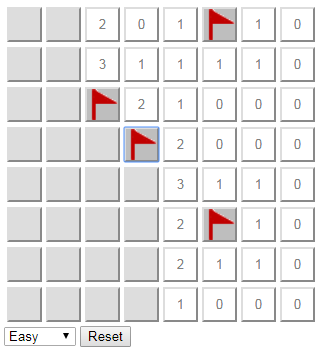

# Minesweeper Game in JavaScript

This is the Minesweeper game implemented in Next.js.

The game provides a grid of different sizes based on difficulty. The goal is to find all of the mines and flag them without left-clicking on any of them. Right-clicking a space will flag it as a mine. Right-clicking a flagged space will unflag it. Left-clicking a mine is a game loss. Left-clicking any non-flagged, non-mine space will display a number that indicates how many adjacent spaces have mines in them. Use these numbers to find the mines.



## Running the Game

```
npm run dev
```

## Running the Unit Tests

```
npm test
```

## Supported Browsers

- Chrome
- Firefox
